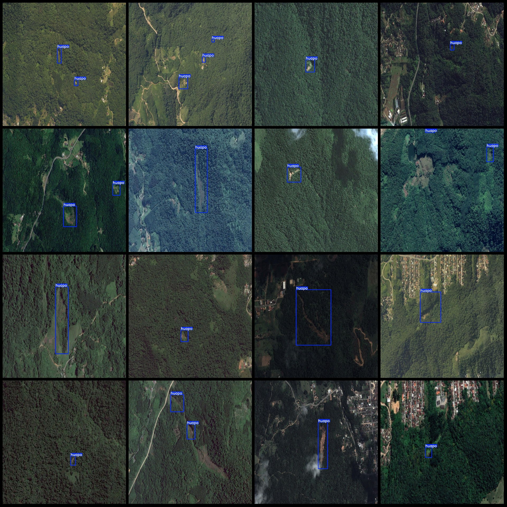
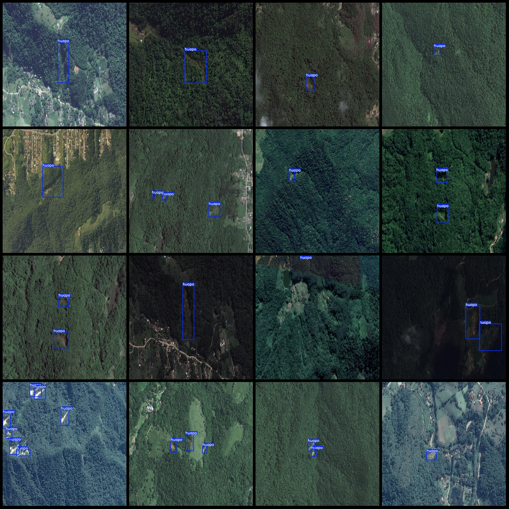

# UAV Perspective Slope Slide Detection Dataset: VOC+YOLO Format with 374 Images and One Category

The dataset format is Pascal VOC format plus YOLO format (excluding the split path's txt file, just containing jpg images as well as their corresponding VOC format xml files and YOLO format txt 
files).

Number of images (jpg file count): 374
Number of annotations (xml file count): 374
Number of annotations (txt file count): 374
Number of annotation categories: 1
Annotation category name: ["huapo"]
Number of boxes per category:
- "huapo" boxes = 760
Total boxes: 760

Number of images occupied by each category:
- "huapo" occupied images = 374
Image resolution: 1024x1024
UAV: DJI MAVIC 3
Collection height: 150m
Collection angle: 90°
Annotation tool used: labelImg
Annotation rules: draw a bounding box for each category
Special note: The dataset does not have been split into training, validation, or test sets; users need to divide it themselves.
Special declaration: This dataset does not guarantee the accuracy of models trained on it or the weight files.

Image preview:

Annotated example:

## Images

Here is a pay link on Stripe ( https://buy.stripe.com/3cs8yP7sY87d0vu9AB ). Please contact me lonlonago@foxmail.com after funding $89, and I will send you a complete data files , thank you!

